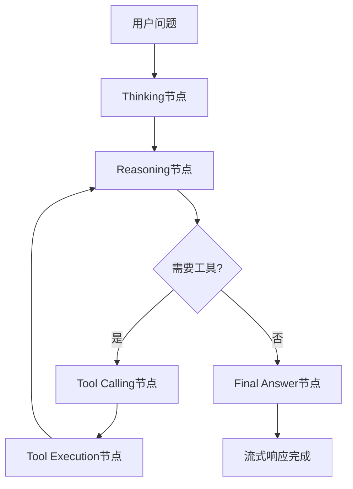

# 流式响应ReAct Agent系统

一个支持真正流式响应的LangGraph ReAct Agent实现，展示了thinking → reasoning → tool_calling → final_answer的完整流程。

## 🚀 主要特性

- ✅ **真正的流式响应**: 实时返回processing信息
- 🔧 **工具调用支持**: 内置数学运算工具 
- 🧠 **多段信息结构**: thinking/reasoning/tool_call/final_answer
- 💾 **文件存储模拟**: TXT文件模拟数据库存储
- 📱 **前端格式**: 模拟前端接收的JSON数据流

## 📁 项目结构

```
src/agents/
├── models.py          # 数据结构定义
├── storage.py         # 存储管理
├── streaming_agent.py # 核心Agent实现
├── api.py            # API接口
└── __init__.py       # 包初始化

demo.py               # 演示程序
database_schema.txt   # 数据库表结构说明
```

## 🎯 快速开始

### 运行演示
```bash
python demo.py
```

### 直接使用API
```python
from agents.api import StreamingAPI

api = StreamingAPI()

# 流式处理
for stream_data in api.ask_question_stream("计算25+37"):
    print(stream_data)
```

## 📊 响应格式示例

### 流式响应格式
```json
{
  "type": "stream",
  "data": {
    "message_id": "uuid",
    "message_type": "thinking",
    "content": "🤔 让我分析一下你的问题...",
    "metadata": {"step": "initial_thinking"},
    "timestamp": "2024-01-01T10:00:00"
  }
}
```

### 完整会话格式
```json
{
  "type": "final_response", 
  "session": {
    "session_id": "uuid",
    "question": "计算25+37",
    "status": "completed"
  },
  "conversation_flow": {
    "thinking_steps": [...],
    "reasoning_steps": [...],
    "tool_operations": [...],
    "final_answers": [...]
  }
}
```

## 🔧 工具支持

目前支持的数学工具:
- `add_numbers(a, b)` - 加法运算
- `multiply_numbers(a, b)` - 乘法运算  
- `divide_numbers(a, b)` - 除法运算

## 💾 数据存储

使用TXT文件模拟数据库存储:
- `data/sessions.txt` - 会话信息
- `data/messages.txt` - 流式消息
- 详细表结构见 `database_schema.txt`

## 🎮 演示模式

1. **流式响应演示** - 观察完整的思考→推理→工具→答案流程
2. **前端格式演示** - 查看前端接收的JSON数据结构
3. **会话管理演示** - 会话历史和管理功能
4. **交互式体验** - 实时问答体验

## 📝 核心流程



## 🔄 实时数据流

每个处理步骤都会实时产生流式消息:
1. `THINKING` - 开始思考分析
2. `REASONING` - 推理过程和结论
3. `TOOL_CALL` - 工具调用准备
4. `TOOL_RESULT` - 工具执行结果  
5. `FINAL_ANSWER` - 最终答案
6. `ERROR` - 错误信息

运行 `python demo.py` 开始体验!